# Plants Project Structure

## Project Architecture Diagram

## Mermaid Source Code

```mermaid
graph TD
    Plants --> Engine
    Plants --> Game
    
    Engine --> GG[GameGeneral]
    Engine --> T[Tools]
    Engine --> REND[Rendering]
    Engine --> EG[EngineGui]
    
    Game --> CORE[Core]
    Game --> GUI[Gui]
    Game --> MINI[Minigiochi]
    Game --> EFF[Effects]
    Game --> DEF[Definitions]
    
    CORE --> CTRL[Obj_Controller]
    CORE --> GAMEC[Game]
    CORE --> WATER[WaterSystem]
    CORE --> DATI[Inventario GameSave]
    CORE --> PIANTA[Obj_Plant Obj_Seed Obj_Ramo]
    CORE --> MONDO[WeatherManager WorldManager FaseGiorno]
    CORE --> UPGRADE[UpgradeSystem]
    CORE --> NOTIFY[NotificationSystem]
    
    GUI --> TOOL[Obj_GuiToolbar]
    GUI --> STATS[Obj_GuiStatsPanel]
    GUI --> INV[Obj_GuiInventoryGrid]
    GUI --> PACK[Obj_GuiPackOpeningAnimation]
    
    MINI --> MBASE[MinigiocoBase]
    MINI --> MGR[ManagerMinigames]
    MINI --> CERCH[MinigiocoCerchio]
    MINI --> SEMI[MinigiocoSemi]
    
    EFF --> WATERFX[ObjWater]
    EFF --> PART[ObjParticles]
    
    DEF --> PSTATS[PlantStats]
    DEF --> SEED[Seed]
```

## Legend

- **Plants**: Entry point (Program.cs, Plants.csproj)
- **Engine**: Custom game engine core
  - **GameGeneral**: Base classes (GameElement, Sprite, Room, AssetLoader)
  - **Tools**: Helpers (Window, ViewCulling, Utils, TrayIcon, SaveHelper, Random, Mouse, Math, Coordinate)
  - **Rendering**: Main render loop, PixelCamera
  - **EngineGui**: ImGui wrappers
- **Game**: Game logic
  - **Core**: Controllers, Game state, Water system, Data (Inventory, Save), Plant objects, World/Weather, Upgrades, Notifications
  - **Gui**: UI components (Toolbar, Stats, Inventory, Pack opening)
  - **Minigiochi**: Minigame system
  - **Effects**: Visual effects (Water, Particles)
  - **Definitions**: Data models (PlantStats, Seed)
